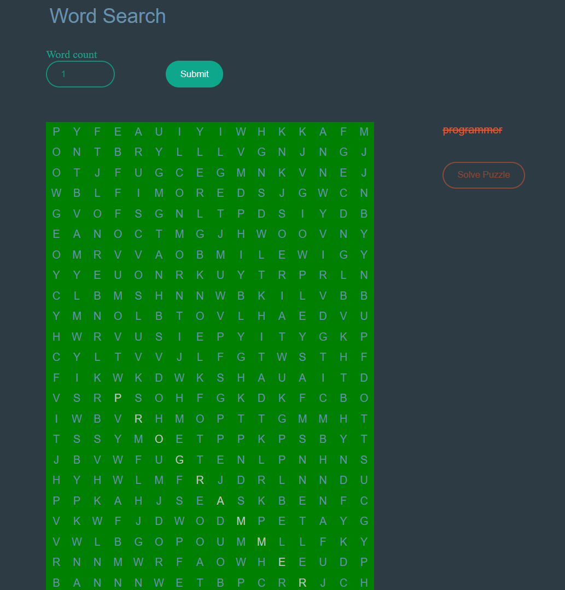

# Word Search Game

Welcome to our Word Search Game! This is a fun and engaging game where you can challenge yourself to find hidden words in a grid of letters. Below, you'll find all the necessary information to get started and enjoy the game to the fullest.

## Features

- **Random Words:** Each game session will have a unique set of words generated randomly.
- **Random Positions:** Words can appear in any position within the grid.
- **Random Directions:** Words can be oriented in four different directions: horizontally, vertically, diagonally (both forward and backward).
- **Variable Difficulty:** You can generate games ranging from 1 up to 50 words, allowing you to customize the challenge level according to your preference.
- **Interactive Gameplay:** To find a word, simply select its starting letter and then drag your cursor to select the entire word.
- **Auto-Solve Feature:** Stuck on a particularly tricky word? No worries! You can use the auto-solve feature to reveal the solution instantly.

## :construction_worker: Getting Started

1. **Installation:** No installation required! Simply access the game through your web browser.
2. **Game Setup:** Choose the number of words you want to include in the game.
3. **Gameplay:** Scan the grid of letters to locate the hidden words. Once you find a word, click on its starting letter and drag your cursor to select the entire word.
4. **Auto-Solve:** If you get stuck or simply want to check your answers, you can use the auto-solve feature to reveal all the words instantly.
5. **Completion:** Complete the game by finding all the words within the grid.

## Credits

This Word Search Game was developed by [Lucas Braga](https://github.com/lucasbbs) based on [Wordfind.js](https://github.com/bunkat/wordfind) and is brought to you with love and passion for word puzzles.

## Contact

Lucas Braga

## :closed_book: License

:closed_book: License

Initially Released in 2021

Completelly refactored in 2024

Made with :heart: by [Lucas Braga](https://github.com/lucasbbs) 🚀.
This project is under the [MIT license](https://github.com/lucasbbs/iMonitor-Backend/master/LICENSE).
